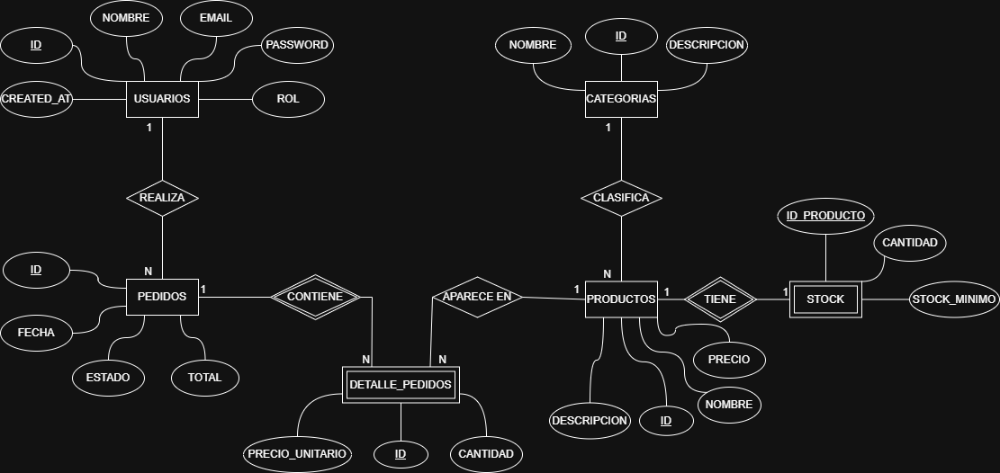
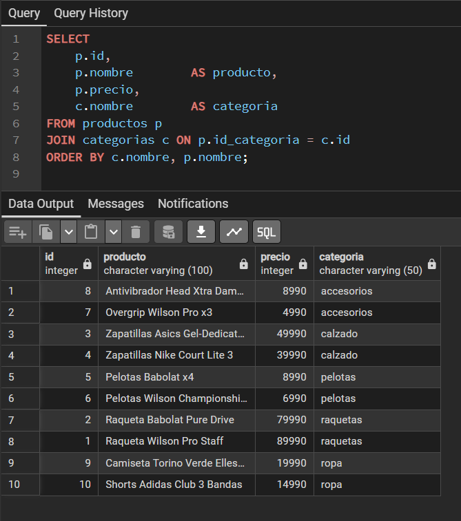
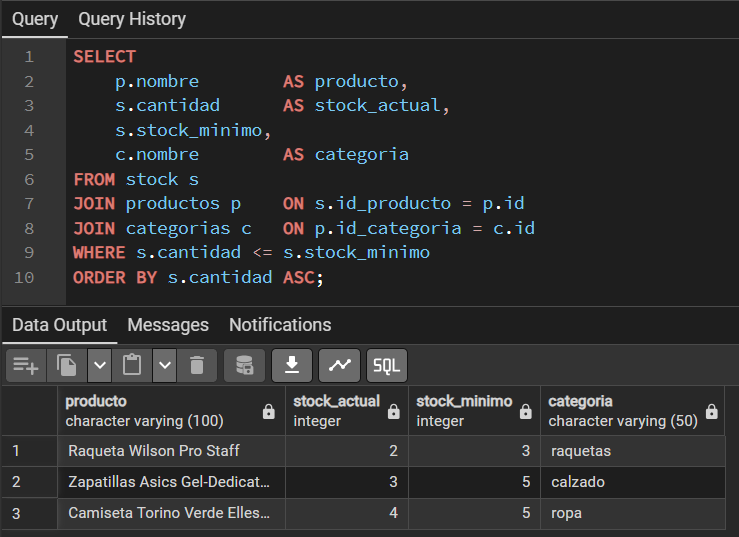
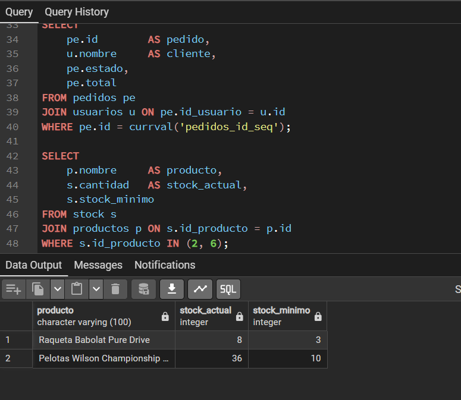

# El Rincón del Tenis — Base de Datos Relacional
**Módulo 5 — Bootcamp AD Academy / Sustantiva**  
**Autor:** Kevin Gamboa | **GitHub:** tiripitipi


## Descripción general

Base de datos relacional del e-commerce El Rincón del Tenis, una tienda especializada en productos de tenis. El modelo gestiona usuarios, productos, categorías, pedidos, detalle de pedidos y stock, permitiendo registrar las operaciones principales de la tienda.

La base de datos distingue dos tipos de usuarios — admin y cliente — y controla la disponibilidad de stock con restricciones que garantizan la integridad de los datos.


## Modelo de datos



### Entidades
| Tabla | Tipo | Descripción |
|-------|------|-------------|
| `usuarios` | Fuerte | Clientes y administradores de la tienda |
| `categorias` | Fuerte | Agrupan los productos del catálogo |
| `productos` | Fuerte | Productos disponibles en la tienda |
| `pedidos` | Fuerte | Pedidos realizados por los clientes |
| `stock` | Débil | Disponibilidad de cada producto |
| `detalle_pedidos` | Débil | Tabla intermedia del N:M entre pedidos y productos |


## Orden de ejecución de los scripts

Es importante ejecutarlos en este orden:
```bash
1. schema.sql       -- crea las tablas y relaciones
2. seed.sql         -- inserta los datos de ejemplo
3. queries.sql      -- consultas de información
4. transaction.sql  -- operación de compra transaccional
```


## Requisitos

- PostgreSQL instalado
- Crear la base de datos antes de ejecutar los scripts:
```sql
CREATE DATABASE rincon_del_tenis;

- Abrir cada script en pgAdmin, conectarse a `rincon_del_tenis` y ejecutar con **F5**


## Evidencia de ejecución

### Consulta 1 — Todos los productos con su categoría


### Consulta 6 — Productos con stock bajo


### Transaction 1 — Compra exitosa con stock actualizado



## Archivos del proyecto

ecommerce-db-m5/
├── diagrama_er.png       -- modelo Entidad-Relación notación Chen
├── schema.sql            -- DDL con tablas, PKs, FKs y restricciones
├── seed.sql              -- datos de ejemplo
├── queries.sql           -- consultas SQL
├── transaction.sql       -- operación de compra transaccional
├── evidencia/            -- capturas de pantalla de las consultas
└── README.md